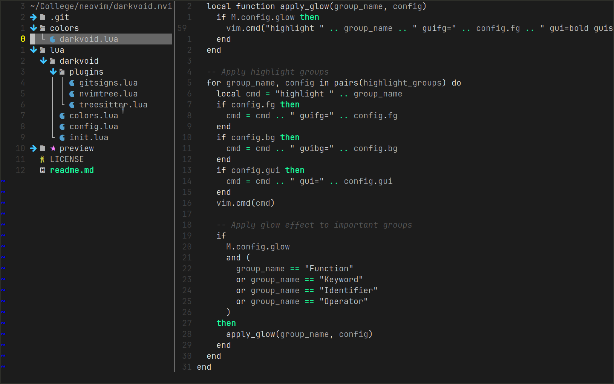
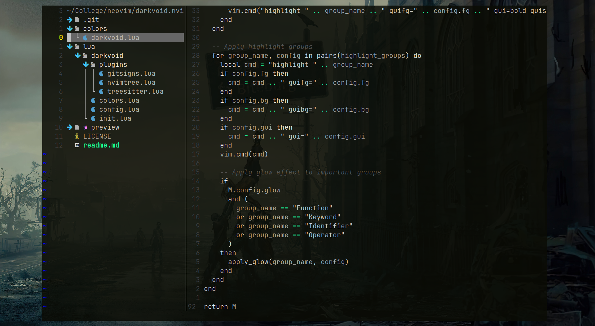
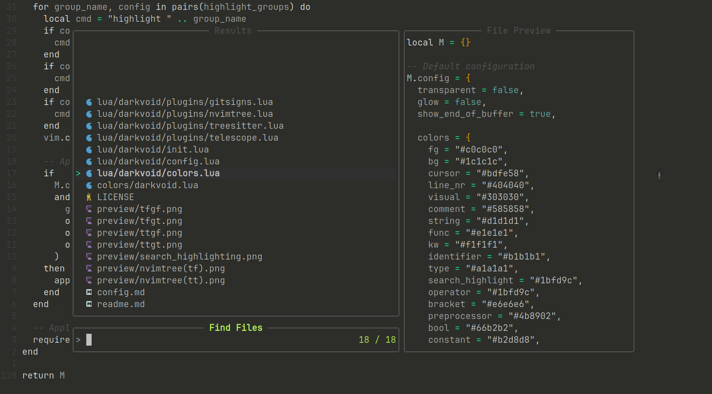
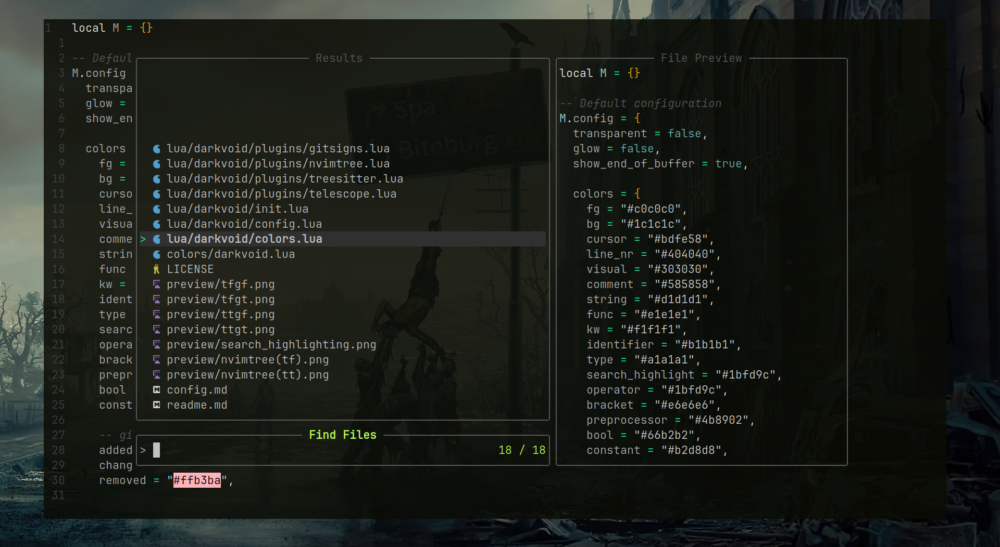

#### Transparency off, Glow off

#### Transparency off, Glow on

#### Transparency on, Glow off

#### Transparency on, Glow on

#### Search Highlighting

#### NvimTree

#### NvimTree (transparent)

#### Telescope

#### Telescope (transparent)

