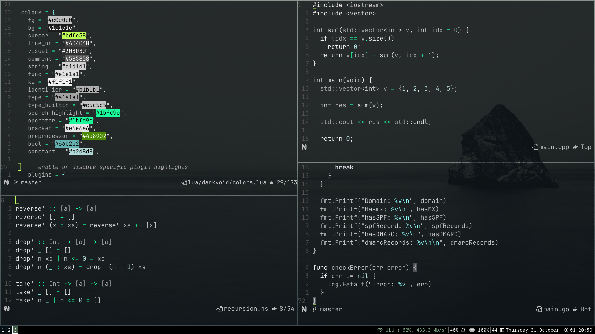

# Darkvoid.nvim

Have you ever been in a dark room coding by yourself? In that dark void, where the only light shines from your PC; the
only thing that matters in that moment. This colorscheme is inspired by that feeling: like a dark void in the deep ocean, where the only lights
are the alien creatures living there; like exploring a dark void in a deep cave where the glow of the mushrooms litters your vision... _Aah, the scenery!_

**Darkvoid.nvim** is same, where only the important stuff.. That is, _your code_, is highlighted. _And if you want, you can make it **glow**!_



## Features

- **Monochromatic Palette**: Carefully selected monochromatic colors to go easy on your eyes and not give too much to take.

- **Glow Effect**: Optional glow effect for key syntax elements like functions, keywords, and operators.

- **Customizable**: Easily configure transparency, glow effect, and color settings to suit your preferences.

- **Plugins**: Supports treesitter, nvimtree, telescope, gitsigns, etc. popular plugins `(If you prefer you can also turn off specific plugins highlights if you don't need them in your config)`.

## Installation

To install `darkvoid.nvim`, you can use your preferred plugin manager. For example, with [packer.nvim](https://github.com/wbthomason/packer.nvim):

```lua
use 'aliqyan-21/darkvoid.nvim'
```

With [lazy.nvim](https://github.com/folke/lazy.nvim):

```lua
return {'aliqyan-21/darkvoid.nvim'}
```

## Configuration

This is how you can configure `darkvoid.nvim` - [Configuration](config.md)

## Preview


###### More Screenshots: [images](preview/screenshots.md)

## Supported Plugins

Currently, darkvoid.nvim supports basic Neovim syntax highlighting and common but necessary plugins like treesitter, telescope, etc.
However, support for more popular plugins is still in progress. The following plugins are supported:

- [x] nvim-tree: File explorer integration
- [x] treesitter: Enhanced syntax highlighting
- [x] telescope: Fuzzy finder integration
- [x] gitsigns: Git integration and signs
- [x] bufferline: buffer tabs
- [x] lualine: lualine support
- [x] oil: oil support (let's get oily)
- [x] whichkey: whichkey support
- [x] nvim-cmp: nvim-cmp support
- [x] nvim-notify: nvim-notify support

... You can add support for other plugins not in list and I will update readme

I welcome contributions from the community to help integrate support for these plugins. If you are interested in contributing, please refer to the Contributing Guidelines section below.

## Contributing

I encourage contributions to enhance the functionality and compatibility of darkvoid.nvim. To contribute:

- Fork the repository.
- Create a new branch for your feature or bug fix.
- Make your changes and test thoroughly.
- Submit a pull request with a detailed description of your changes.
- Please follow the coding standards and ensure that your contributions adhere to the project's guidelines.

## License

darkvoid.nvim is licensed under the MIT License.
