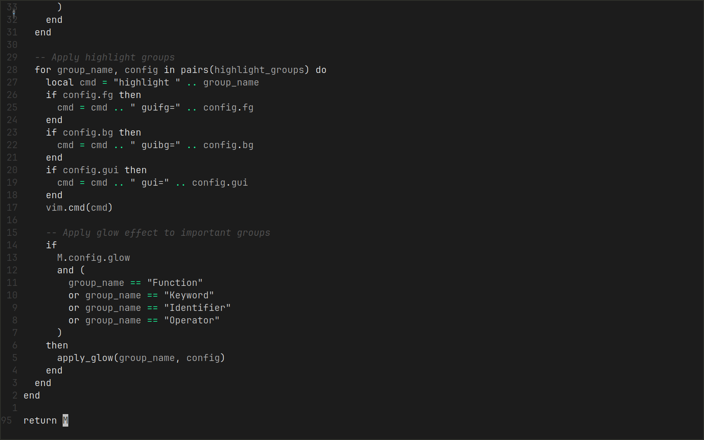
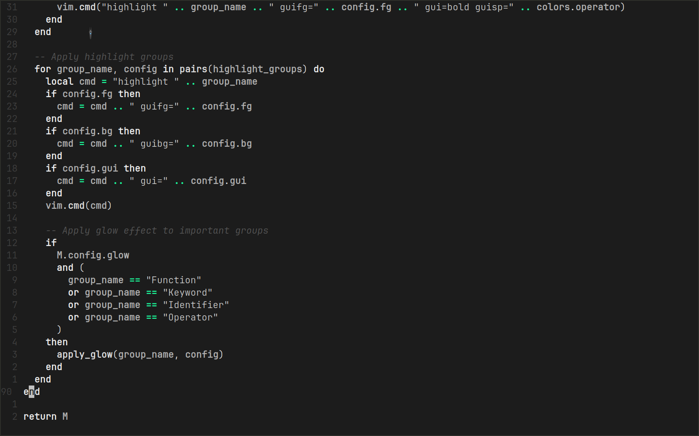
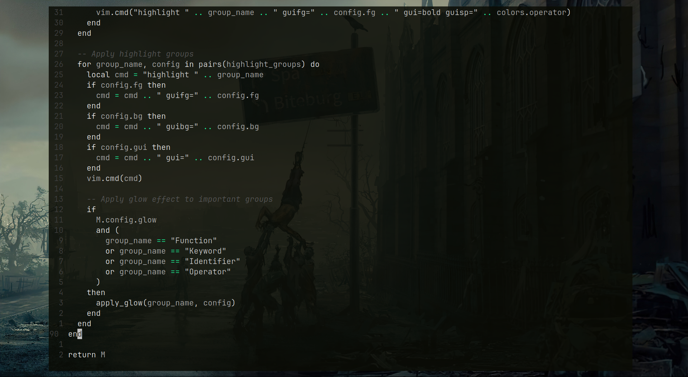
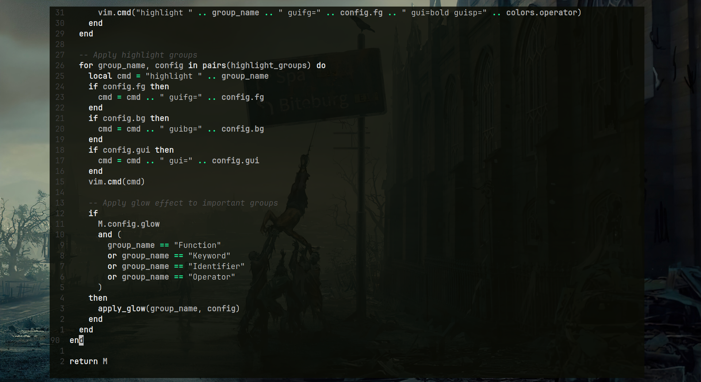
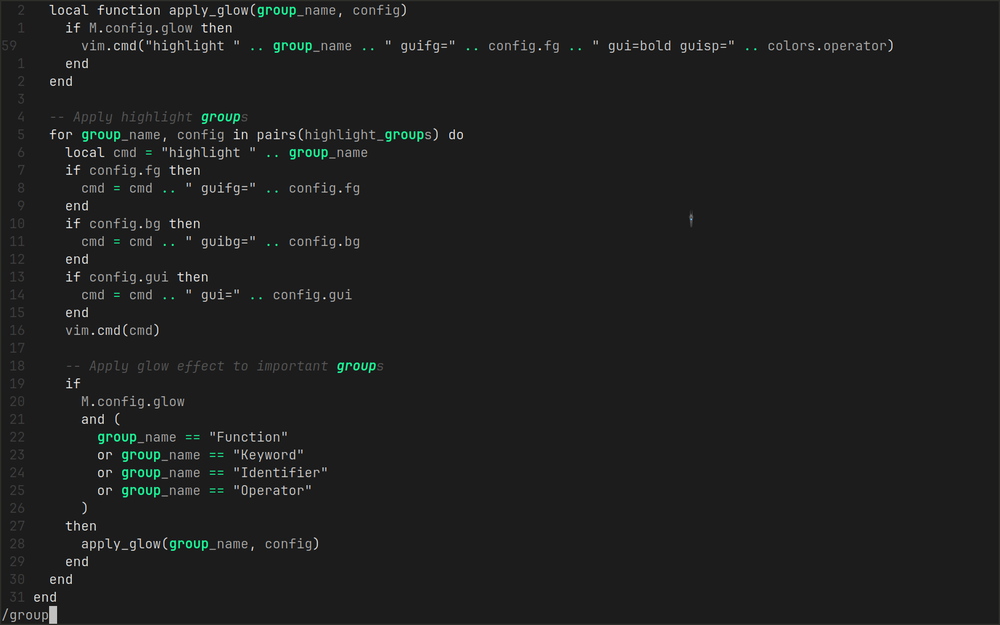

# Darkvoid.nvim

Have you ever been in a dark room coding by yourself in that dark void with only glow coming from your pc which is the 
only important thing right now, this colorscheme is inspired by that, it's like the deep ocean darkvoid where the only glowing things 
are the alien creature living there, it's like a deep cave darkvoid where the glow is coming 
out of the mushrooms while exploring...Aah the scenery!

**Darkvoid.nvim** is same, where only important stuff, that is, your code is highlighted and if you want, you can make it glow!

## Features

- **Monochromatic Palette**: Carefully selected monochromatic colors to go easy on your eyes and not give too much to take.

- **Glow Effect**: Optional glow effect for key syntax elements like functions, keywords, and operators.

- **Customizable**: Easily configure transparency, glow effect, and color settings to suit your preferences.

## Installation

To install `darkvoid.nvim`, you can use your preferred plugin manager. For example, with [packer.nvim](https://github.com/wbthomason/packer.nvim):

```lua
use 'aliqyan-21/darkvoid.nvim'
```


To install `darkvoid.nvim`, you can use your preferred plugin manager. For example, with [lazy.nvim](https://github.com/folke/lazy.nvim):

```lua
return {'aliqyan-21/darkvoid.nvim'}
```

## Configuration
This is how you can configure `darkvoid.nvim` - [Configuration](config.md) 

## Colorscheme Preview

### Transparency off, Glow off 
 

### Transparency off, Glow on 
 

### Transparency on, Glow off 
 

### Transparency on, Glow on 
 

### Search Highlighting
 

### NvimTree
.png) 

### NvimTree (transparent)
.png) 

## Supported Plugins
Currently, darkvoid.nvim supports basic Neovim syntax highlighting. However, support for popular plugins is still in progress. The following plugins are planned for support:

- [x] nvim-tree: File explorer integration
- [x] treesitter: Enhanced syntax highlighting
- [ ] telescope: Fuzzy finder integration
- [x] gitsigns: Git integration and signs
- [ ] bufferline: buffer tabs
- [ ] lualine: lualine support

... You can add support for other plugins not in list and I will update readme

I welcome contributions from the community to help integrate support for these plugins. If you are interested in contributing, please refer to the Contributing Guidelines section below.

## Contributing

I encourage contributions to enhance the functionality and compatibility of darkvoid.nvim. To contribute:

- Fork the repository.
- Create a new branch for your feature or bug fix.
- Make your changes and test thoroughly.
- Submit a pull request with a detailed description of your changes.
- Please follow the coding standards and ensure that your contributions adhere to the project's guidelines.

## License

darkvoid.nvim is licensed under the MIT License.
